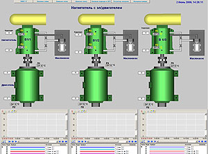
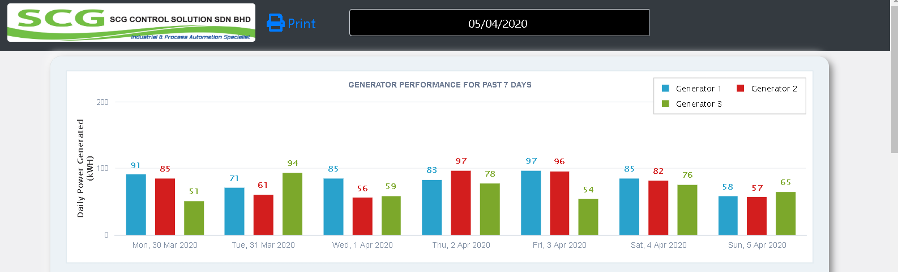
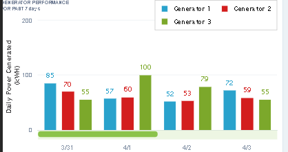

# Energy Monitoring Dashboard for Power Plant industry
## [Live Demo](https://winson-dashboard.herokuapp.com/)

Dashboard allow Engineers, Plant manager to view Generator Records from a
Web

Python is serving as the back-end server storing the data in the postgre database.
The data will be push to the database using SCADA software.

SCADA is an industrial software which provide a human-machine interface created by programmers and is normally used in Industrial Process which allow operators or engineers
to monitor and control their machines.SCADA software normally communicate with Industry digital computer(PLC) to retrieve physical data and push the data to the database.

# Barchart and Line Trending
The Web app will render a line trending, barchart and tables using ZingChart with data gathered
from the Postgres Database via an HTTP Request 'GET' from the server to the endpoints.
A Date Selection is available to choose which day to view the information.
.

# Mobile responsive
Responsive Barchart and Line Trends

### Print as PDF document
The barchart, and tables can be created as pdf using jsPDF library.
This function will be only enable in deskstop mode.

